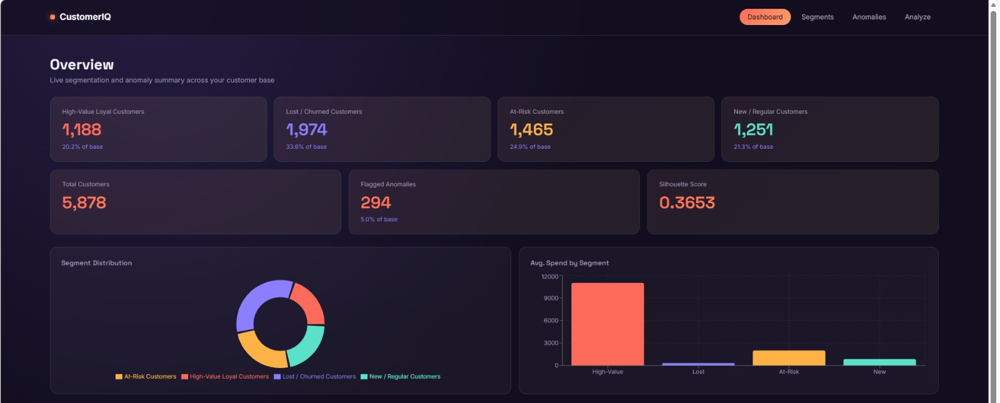
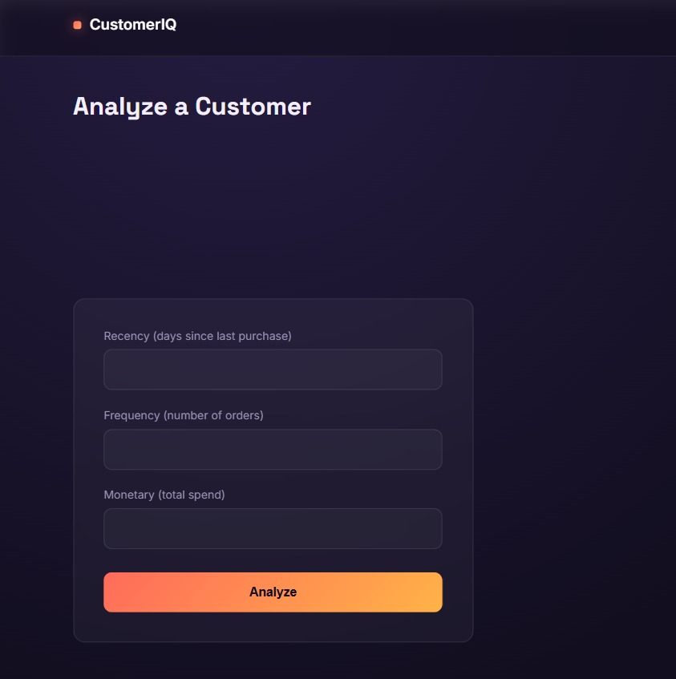
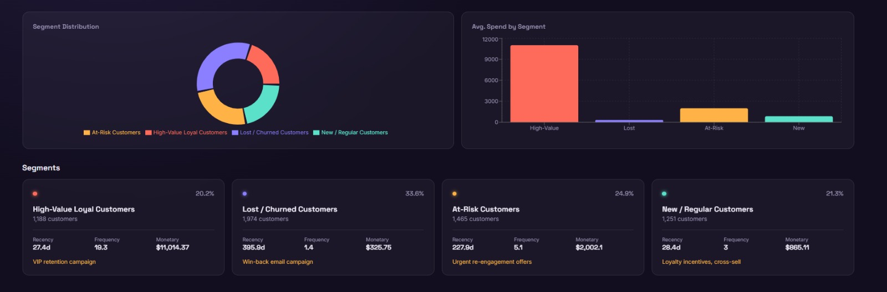
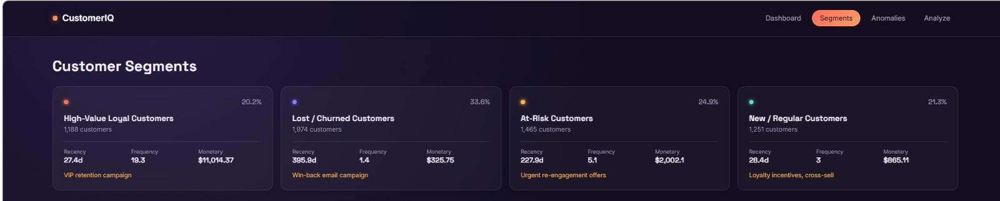
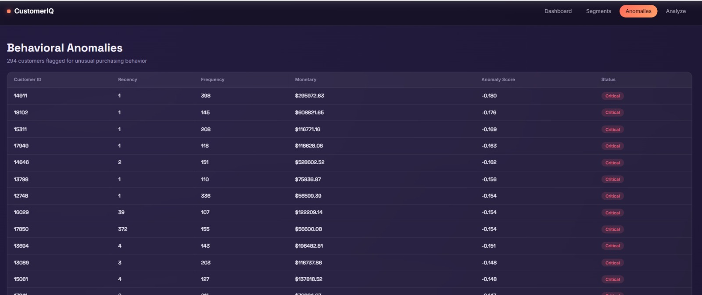
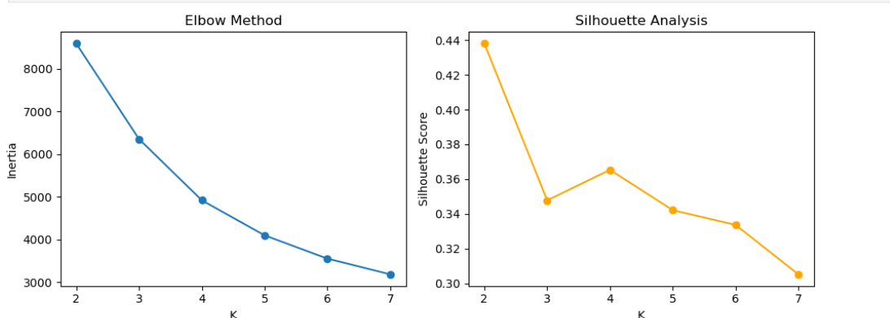
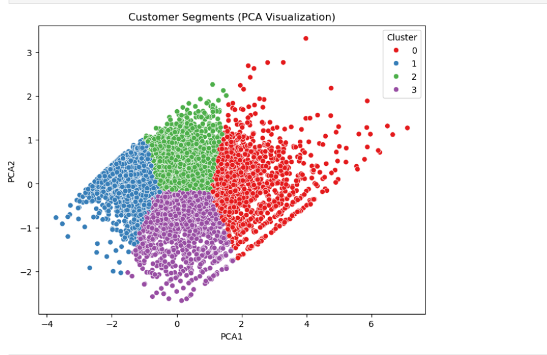
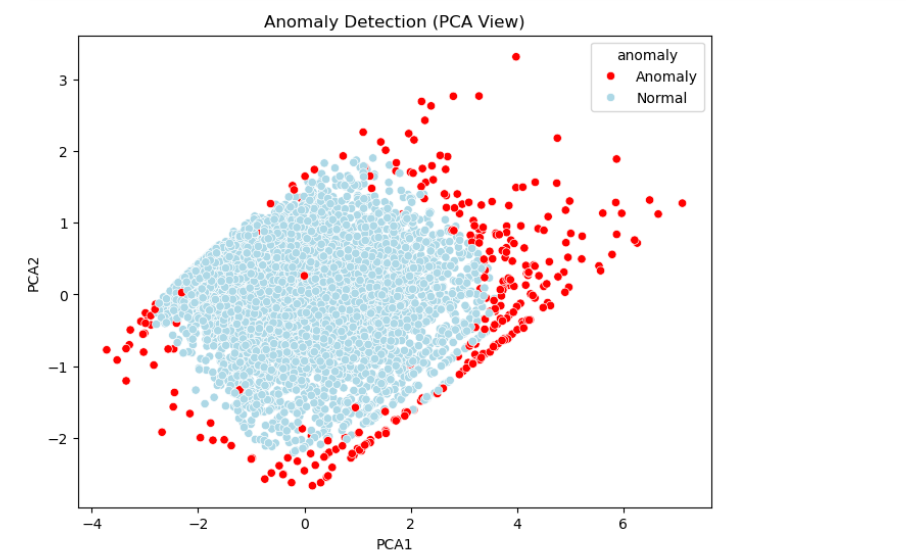

<div align="center">

# CustomerIQ

**Unsupervised Machine Learning Platform for Customer Segmentation, Behavioral Analytics & Anomaly Detection**


CustomerIQ takes raw e-commerce transaction data and automatically discovers customer segments, flags unusual purchasing behavior, and turns unsupervised ML output into business-ready recommendations — end to end, from a Jupyter notebook to a deployed API and dashboard.

</div>

---

## Table of Contents

- [Overview](#overview)
- [Dashboard Preview](#dashboard-preview)
- [Architecture](#architecture)
- [Tech Stack](#tech-stack)
- [Dataset](#dataset)
- [ML Pipeline](#ml-pipeline)
- [Model Evaluation](#model-evaluation)
- [Discovered Segments](#discovered-segments)
- [Anomaly Detection](#anomaly-detection)
- [API Reference](#api-reference)
- [Project Structure](#project-structure)
- [Getting Started](#getting-started)
- [Roadmap](#roadmap)
- [Author](#author)

---

## Overview

Most clustering projects stop at `KMeans(n_clusters=4)` and a scatter plot. CustomerIQ goes further — every stage of the pipeline is validated with real metrics, every cluster is translated into a business persona with a recommended action, and the whole thing is served through a production-style FastAPI backend with a React dashboard on top.

| | |
|---|---|
| **Problem** | A retailer has raw transaction logs but no labeled customer categories |
| **Approach** | Unsupervised ML — RFM feature engineering, K-Means clustering, Isolation Forest anomaly detection, KNN similarity search |
| **Output** | A live API + dashboard that turns "Customer belongs to Cluster 2" into "High-Value Loyal Customer — recommend VIP retention campaign" |

---

## Dashboard Preview

**Overview** — live stats per segment, distribution chart, and average spend comparison



**Segment Distribution & Spend Comparison**



**Customer Segments** — each cluster translated into a named persona with recommended action



**Behavioral Anomalies** — flagged customers ranked by anomaly severity



**Analyze a Customer** — live prediction against the trained model



---

## Architecture

```
 React Dashboard  (Vite + Recharts)
        │  axios / REST
        ▼
 FastAPI Backend  (routers: health · analyze · customers · segments · anomalies)
        │
        ├── Clustering Model   (K-Means, k=4)
        ├── Anomaly Model      (Isolation Forest)
        ├── Similarity Model   (KNN, Euclidean)
        └── Scaler + Metadata  (StandardScaler, cluster labels, eval scores)
        │
        ▼
 customer_behavior.csv   (RFM features, cluster assignments, anomaly flags)
        ▲
        │
 ML Pipeline (Jupyter)
        │
 Raw Transactions (Online Retail II, UCI)
```

Every model is trained once in the notebook, serialized with `joblib`, and loaded once at API startup — no retraining happens on request.

---

## Tech Stack

| Layer | Tools |
|---|---|
| Data processing | pandas, numpy |
| Machine learning | scikit-learn — K-Means, Isolation Forest, K-Nearest Neighbors, PCA, StandardScaler |
| Model evaluation | Silhouette Score, Davies–Bouldin Index, Calinski–Harabasz Score |
| Backend | FastAPI, Pydantic, uvicorn |
| Model persistence | joblib, JSON metadata |
| Frontend | React (Vite), React Router, Axios, Recharts |
| Visualization (EDA) | matplotlib, seaborn |

---

## Dataset

**[Online Retail II](https://archive.ics.uci.edu/dataset/502/online+retail+ii)** (UCI Machine Learning Repository) — real invoice-level transactions from a UK-based online retailer, December 2009 to December 2011.

| Stage | Rows | Customers |
|---|---|---|
| Raw | 1,067,371 | — |
| After cleaning (dropped missing IDs, cancellations, invalid values) | 805,549 | 5,878 |

---

## ML Pipeline

```
Raw Transactions
      │
      ▼
Data Cleaning            → drop missing Customer IDs, cancelled orders, invalid quantity/price
      │
      ▼
RFM Feature Engineering  → Recency, Frequency, Monetary per customer
      │
      ▼
Log Transform + Scaling  → np.log1p() to correct skew, StandardScaler to normalize
      │
      ▼
Model Selection           → Elbow Method + Silhouette Analysis across K = 2..7
      │
      ▼
K-Means Clustering        → K = 4, empirically selected
      │
      ▼
Cluster Profiling          → business-named segments with recommended actions
      │
      ▼
PCA Visualization           → 3 features → 2D, 94.1% variance retained
      │
      ▼
Isolation Forest            → flag behavioral anomalies (contamination = 0.05)
      │
      ▼
KNN Similarity Index        → find comparable customers by Euclidean distance
      │
      ▼
Model Serialization         → joblib .pkl files + metadata.json
      │
      ▼
FastAPI Backend
```

### Choosing K empirically

K was not guessed — the Elbow Method and Silhouette Score were computed across a range of candidates before selecting K = 4.

<table>
<tr>
<td width="55%">

| K | Silhouette Score |
|---|---|
| 2 | 0.4381 |
| 3 | 0.3478 |
| 4 | **0.3653** ← selected |
| 5 | 0.3421 |
| 6 | 0.3336 |
| 7 | 0.3052 |

K=2 scores highest but only yields two generic groups. K=4 sits at the elbow of the inertia curve and produces four business-distinguishable personas — the right trade-off between statistical quality and business usefulness.

</td>
<td>



</td>
</tr>
</table>

### PCA Visualization

The 3 scaled RFM features were reduced to 2 dimensions for visualization, retaining 94.1% of the original variance (PC1: 76.4%, PC2: 18.8%). The four clusters separate cleanly even in 2D:



---

## Model Evaluation

Because this is unsupervised learning, there is no ground-truth label to check accuracy against — quality is measured through cluster-separation metrics instead.

| Metric | Score | Interpretation |
|---|---|---|
| Silhouette Score | 0.3653 | Moderate, well-separated clusters (real customer behavior rarely clusters perfectly) |
| Davies–Bouldin Index | 0.9303 | Below 1.0 — clusters are compact and reasonably distinct |
| Calinski–Harabasz Score | 5061.72 | High between-cluster variance relative to within-cluster variance |

---

## Discovered Segments

| Segment | % of Base | Avg. Recency | Avg. Frequency | Avg. Monetary | Recommended Action |
|---|---|---|---|---|---|
| 🟠 **High-Value Loyal Customers** | 20.2% | 27.4 days | 19.3 orders | $11,014.37 | VIP retention campaign |
| 🟣 **Lost / Churned Customers** | 33.6% | 395.9 days | 1.4 orders | $325.75 | Win-back email campaign |
| 🟡 **At-Risk Customers** | 24.9% | 227.9 days | 5.1 orders | $2,002.10 | Urgent re-engagement offers |
| 🟢 **New / Regular Customers** | 21.3% | 28.4 days | 3.0 orders | $865.11 | Loyalty incentives, cross-sell |

Instead of a raw cluster ID, every prediction returns a business persona and a recommended action — the design goal from day one.

---

## Anomaly Detection

Isolation Forest flagged **294 customers (~5%)** whose purchasing behavior deviates sharply from the rest of the base — high-frequency, high-spend accounts that behave more like wholesale buyers than typical retail customers.

| | Recency | Frequency | Monetary |
|---|---|---|---|
| Normal customers | 207.1 days | 4.9 orders | $1,776.57 |
| Flagged anomalies | 91.8 days | 33.3 orders | $26,609.14 |



Anomalies sit visibly on the outer edge of the customer population in PCA space — confirming the model is catching genuine outliers, not noise.

---

## API Reference

Interactive docs are auto-generated by FastAPI at `/docs` (Swagger UI) and `/redoc`.

| Method | Endpoint | Description |
|---|---|---|
| `GET` | `/api/model/health` | Confirms all models loaded successfully |
| `GET` | `/api/model/metrics` | Returns Silhouette, Davies–Bouldin, Calinski–Harabasz scores |
| `POST` | `/api/customer/analyze` | Predicts segment + anomaly status for a given RFM profile |
| `POST` | `/api/customer/similar` | Returns the N most similar customers via KNN |
| `GET` | `/api/customers` | Paginated list of all customers |
| `GET` | `/api/customers/{id}` | Single customer detail |
| `GET` | `/api/segments` | Summary of all 4 segments with stats |
| `GET` | `/api/segments/{id}` | Single segment detail + sample customers |
| `GET` | `/api/anomalies` | All flagged anomaly customers, sorted by severity |
| `GET` | `/api/anomalies/{id}` | Single anomaly customer detail |

**Example — `POST /api/customer/analyze`**

```json
// Request
{
  "recency": 10,
  "frequency": 20,
  "monetary": 5000
}

// Response
{
  "segment": "High-Value Loyal Customers",
  "cluster_id": 0,
  "anomaly": false,
  "anomaly_score": 0.0842,
  "recommended_action": "VIP retention campaign"
}
```

---

## Project Structure

```
CustomerIQ-Segmentation-Platform/
├── data/
│   └── raw/                       # online_retail_II.xlsx
├── notebooks/
│   └── eda_and_modeling.ipynb     # full ML pipeline
├── models/
│   ├── clustering_model_v1.pkl
│   ├── scaler_v1.pkl
│   ├── anomaly_model_v1.pkl
│   ├── knn_model_v1.pkl
│   └── metadata.json
├── customer_behavior.csv          # processed RFM + cluster + anomaly data
├── backend/
│   ├── main.py
│   ├── config.py
│   ├── schemas.py
│   ├── model_loader.py
│   ├── routers/
│   │   ├── health.py
│   │   ├── analyze.py
│   │   ├── customers.py
│   │   ├── segments.py
│   │   └── anomalies.py
│   └── utils/
│       └── preprocessing.py
├── frontend/
│   └── src/
│       ├── pages/                 # Dashboard, Segments, Anomalies, CustomerAnalyze
│       ├── components/            # Navbar, StatCard, SegmentCard, AnomalyTable
│       └── services/api.js
└── docs/                          # screenshots and evaluation charts
```

---

## Getting Started

### Backend

```bash
cd backend
python -m venv venv
venv\Scripts\Activate.ps1        # Windows PowerShell
pip install -r requirements.txt
uvicorn main:app --reload
```
API available at `http://127.0.0.1:8000` · Docs at `http://127.0.0.1:8000/docs`

### Frontend

```bash
cd frontend
npm install
npm run dev
```
Dashboard available at `http://localhost:5173`

---

## Roadmap

- [ ] PostgreSQL persistence layer (replacing static CSV)
- [ ] Docker Compose for one-command setup
- [ ] Cloud deployment (Render / Railway backend, Vercel frontend)
- [ ] Authentication for multi-user access

---

## Author

**Muzammil Ahmed**
Computer Science (AI Specialization) — NED University of Engineering & Technology, Karachi

[GitHub](https://github.com/muzammilahmed321)

</div>
